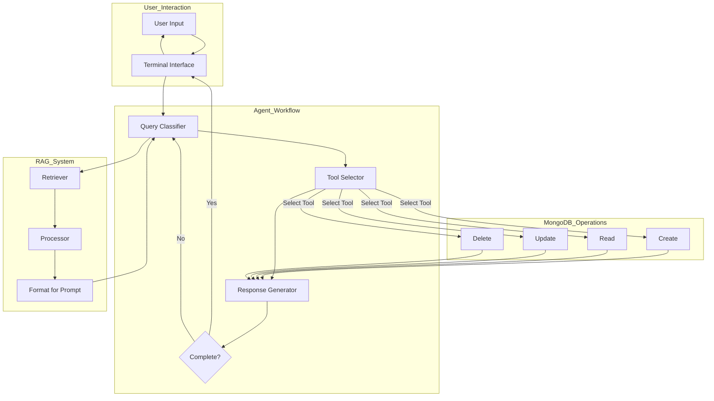

# AI Agent Workflow with RAG and MongoDB Integration

A conversational AI agent built with LangGraph and Gemini 2.0 Flash that uses Retrieval-Augmented Generation (RAG) to process JSON data and perform CRUD operations on a MongoDB Atlas database.

## Features

- Agent workflow that iteratively processes user requests
- RAG implementation for enhanced context understanding
- MongoDB Atlas integration for database operations
- Support for CRUD operations (Create, Read, Update, Delete)
- Tool selection based on user intent

## Architecture

The system implements a loop-based agent workflow that:

1. Processes user input
2. Determines required actions/tools
3. Retrieves relevant context from JSON data
4. Performs database operations as needed
5. Responds with appropriate information or asks for clarification



## System Components

### 1. Terminal Interface

- Simple command-line chat interface
- User input processing and response formatting
- Exit mechanism with 'q' command

### 2. Agent Workflow (LangGraph Implementation)

- State machine with nodes for query classification, tool selection, and response generation
- Uses Gemini 2.0 Flash as the reasoning engine
- Implements loop-based approach for iterative refinement
- Conditional edges for handling incomplete queries

### 3. RAG Implementation

- Vector database integration (ChromaDB) for semantic search
- Sentence transformer embeddings for similarity search
- Context window management and processing
- Integrates retrieved context into agent prompts

### 4. MongoDB Integration

- Connection pool management with error handling
- CRUD operation abstractions with JSON data synchronization
- Tool-based database interactions
- Automatic data refresh for RAG system

### 5. Tool Framework

- Tool registry with metadata using Pydantic models
- Input validation and schema enforcement
- Tool selection based on intent classification
- MongoDB tools for Create, Read, Update, Delete operations

## Prerequisites

- Python 3.8+
- MongoDB Atlas account
- Gemini 2.0 Flash API key

## Installation

```bash
# Clone the repository
git clone https://github.com/pratham2403/rag-llm-web.git
cd rag-llm-web

# Create a virtual environment
python -m venv venv
source venv/bin/activate  # On Windows: venv\Scripts\activate

# Install dependencies
pip install -r requirements.txt
```

## Configuration

1. Create a `.env` file in the project root with:

```
GEMINI_API_KEY=your_gemini_api_key
MONGODB_URI=your_mongodb_connection_string
```

2. Configure your MongoDB collections in `config.json`

## Usage

```bash
# Start the application
python app.py
```

## Project Structure

```
chat-tool/
├── app.py                  # Main application entry point
├── .env                    # Environment variables
├── config.json             # MongoDB collection configuration
├── requirements.txt        # Package dependencies
├── src/
│   ├── agent/
│   │   ├── workflow.py     # LangGraph agent workflow implementation
│   │   └── tools.py        # Custom tools for the agent
│   ├── db/
│   │   └── mongodb.py      # MongoDB connection and operations
│   ├── rag/
│   │   ├── retriever.py    # Context retrieval logic
│   │   └── processor.py    # Process retrieved information
│   ├── cli/
│   │   └── terminal.py     # Terminal interface logic
│   └── utils/
│       └── helpers.py      # Utility functions
└── data/
    └── user.json           # JSON files for RAG context
```

## Example Interactions

```
User: "Create a new user with name John Doe and email john@example.com"
Agent: "I'll create a new user. Do you want to specify any additional fields like 'age' or 'role'?"
User: "Yes, add age 30 and role developer"
Agent: "Creating user with name: John Doe, email: john@example.com, age: 30, role: developer... User created successfully!"
```

```
User: "Get all users"
Agent: "Retrieving all users from database... Found 5 users. Here they are: [user list]"
```

## Technical Implementation Details

### 1. Query Classification

The system uses Gemini 2.0 Flash to classify user queries into appropriate operations:

- **CREATE**: Adding new user records
- **READ**: Retrieving user information
- **UPDATE**: Modifying existing user data
- **DELETE**: Removing user records

### 2. RAG Integration

- Uses embeddings to search for relevant context in user data
- Processes retrieved information to format it for the LLM prompt
- Provides database schema information to guide the agent

### 3. Tool Selection

- Extracts parameters from user queries
- Maps intent to appropriate database operation
- Validates input data using Pydantic models

### 4. Database Synchronization

- Maintains consistency between MongoDB and local JSON data
- Refreshes vector embeddings when data changes
- Handles error conditions gracefully

## Development

### Adding New Collections

To add support for new collections beyond users:

1. Update `config.json` with the new collection schema
2. Extend the MongoDB class with appropriate methods
3. Create new Pydantic models in tools.py
4. Implement tool methods in the DatabaseTools class
5. Update the query classifier to recognize new collection operations

## License

MIT
