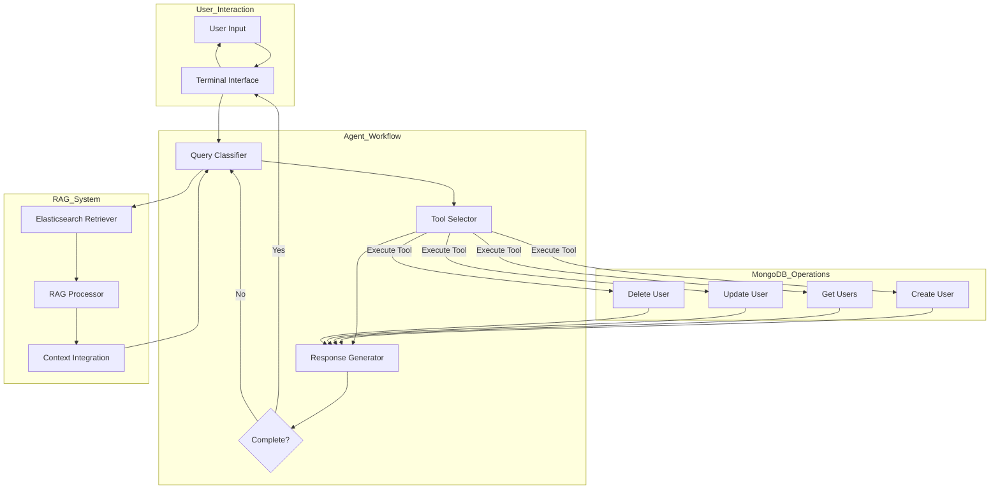

# AI Agent with RAG and MongoDB Integration

A conversational AI agent built with LangGraph and Google's Gemini 2.0 Flash that uses Retrieval-Augmented Generation (RAG) to process JSON data and perform CRUD operations on a MongoDB database.

## Features

- Agent workflow that processes user requests through a multi-step state machine
- RAG implementation using Elasticsearch for efficient data retrieval
- MongoDB integration for database operations
- Support for CRUD operations on user data
- Terminal-based interface for interaction

## Architecture

The system implements a state machine-based agent workflow that:

1. Processes user input
2. Classifies the query type (Create, Read, Update, Delete)
3. Selects and executes the appropriate tool
4. Generates a natural language response
5. Determines if the interaction is complete or needs follow-up



This architecture uses LangGraph to orchestrate the workflow and Gemini 2.0 Flash as the LLM for agent reasoning.

## System Components

### 1. Terminal Interface (`src/cli/terminal.py`)
- Simple command-line chat interface for user interaction
- Handles user input and displays agent responses
- Provides exit mechanism with 'q' command

### 2. Agent Workflow (`src/agent/workflow.py`)
- Implements a StateGraph using LangGraph
- Uses Gemini 2.0 Flash as the reasoning engine
- Contains nodes for query classification, tool selection, and response generation
- Includes conditional edges for handling incomplete queries

### 3. RAG Implementation (`src/rag/`)
- `retriever.py`: Uses Elasticsearch for efficient text retrieval
- `processor.py`: Processes retrieved information for the LLM context
- Integrates structured JSON data into the agent's reasoning process

### 4. MongoDB Integration (`src/db/mongodb.py`)
- Handles connection to MongoDB database
- Provides methods for CRUD operations on user data
- Manages error handling and connection lifecycle

### 5. Database Tools (`src/agent/tools.py`)
- Defines Pydantic models for CRUD operations
- Implements tool methods for the agent to interact with MongoDB
- Validates input data before database operations

## Prerequisites

- Python 3.8+ (Python 3.12 recommended)
- MongoDB database
- Gemini API key (from Google AI Studio)
- Elasticsearch 8.x (for RAG implementation)

## Installation

```bash
# Clone the repository
git clone https://github.com/yourusername/chat-tool.git
cd chat-tool/server

# Create a virtual environment
python -m venv venv
source venv/bin/activate  # On Windows: venv\Scripts\activate

# Install dependencies
pip install -r requirements.txt
```

You'll need to set up the following services:
1. MongoDB - either locally or using a cloud service
2. Elasticsearch - for the RAG implementation

For local development, you can use the provided Docker setup which includes both services.

## Configuration

Create a `.env` file in the project root with:

```
GEMINI_API_KEY=your_gemini_api_key
MONGODB_URI=your_mongodb_connection_string
```

For local development with Docker, the docker-compose.yaml already configures MongoDB URI as:
```
MONGODB_URI=mongodb://mongodb:27017/chat-tool
```

You only need to provide your Gemini API key in the .env file or set it directly in the environment.

## Running with Docker (Development Only)

The application can be run using Docker for development purposes:

```bash
# Build and start the containers
docker-compose up

# To stop the containers
docker-compose down
```

Note: This Docker setup is intended for development purposes only. For production, a more robust configuration would be needed.

## Starting the Application Directly

```bash
# Start the application
python app.py
```

## Project Structure

```
server/
├── app.py                  # Main application entry point
├── config.json             # MongoDB collection configuration
├── docker-compose.yaml     # Docker configuration for development
├── Dockerfile              # Docker image definition
├── requirements.txt        # Package dependencies
├── README.md               # This documentation
├── src/
│   ├── agent/
│   │   ├── workflow.py     # LangGraph agent workflow implementation
│   │   └── tools.py        # Database tools for the agent
│   ├── db/
│   │   └── mongodb.py      # MongoDB connection and operations
│   ├── rag/
│   │   ├── retriever.py    # Elasticsearch-based retriever
│   │   └── processor.py    # Process retrieved information
│   ├── cli/
│   │   └── terminal.py     # Terminal interface
│   └── utils/
│       └── helpers.py      # Utility functions
└── data/
    └── user.json           # JSON data for RAG context
```

## Example Interactions

```
User: "Create a new user with name John Doe and email john@example.com"
Agent: "I'll create a new user. Do you want to specify any additional fields like age or role?"
User: "Yes, age 30 and role developer"
Agent: "Creating user with name: John Doe, email: john@example.com, age: 30, role: developer... User created successfully!"
```

```
User: "Get all users"
Agent: "Retrieving all users from database... Found 3 users:
- John Doe (john@example.com): 30, developer
- Jane Smith (jane@example.com): 28, designer
- Bob Johnson (bob@example.com): 35, manager"
```

```
User: "Update John Doe's role to senior developer"
Agent: "User John Doe updated. Role changed from developer to senior developer."
```

```
User: "Delete the user with email bob@example.com"
Agent: "Are you sure you want to delete user Bob Johnson?"
User: "Yes"
Agent: "User Bob Johnson with email bob@example.com has been deleted."
```

## Technical Implementation

The project uses a state machine approach with LangGraph to process user queries:

1. **Query Classification**: Analyzes user input to determine intent
2. **Tool Selection**: Chooses the appropriate database operation
3. **Response Generation**: Creates a natural language response
4. **Completion Check**: Determines if the interaction requires follow-up

The RAG component uses Elasticsearch to efficiently retrieve relevant context from JSON data, which helps the agent understand entity references and user intent.

## Dependencies

The main dependencies for this project are:
- `python-dotenv`: For loading environment variables
- `pymongo`: For MongoDB database operations
- `pydantic`: For data validation
- `langchain` & `langchain-google-genai`: For LLM integration
- `langgraph`: For building the agent workflow
- `elasticsearch`: For the RAG component

## License

MIT
